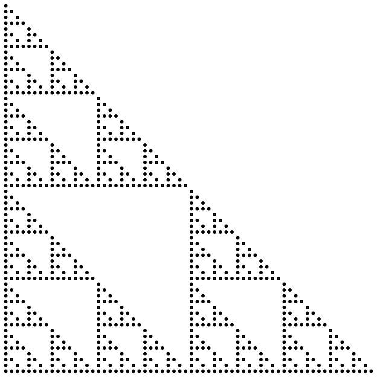

Extracting the Power of Dependent Types
=======================================

This repository hosts the sources of the paper
"Extracting The Power of Dependent Types" by
Artjoms Sinkarovs and Jesper Cockx.

Key idea
--------

In this paper we demonstrate a technique on enriching
your language with dependent types by first embedding it
in Agda and then extracting the programs into the original
language so that existing tools could be used.
Within the shallow embedding full power of dependent types
can be used to prove properties about programs.  Translation
from the shallow embedding is the main novelty of the approach.
It is based on Agda's reflection capabilities, so it becomes
possible to express simultaneously:

 * shallow embedding;
 * programs in the embedding; and
 * compiler from the embedding into the original language.

The paper focuses on demonstrating basic ingredients of the
technique.  Therefore, we have consciously chosen a minimalist
language that lets us express programs that require dependencies
between the values and the invariants we are observing.
Our example language is PostScript, and our invariant is the
stack length.

Example
=======

As an example, consider the following embedded program, its extracted
version and postscript-generated picture.

```agda
sierpinski : Stack (1 + n) → Stack n
sierpinski s  =
  s ▹ push 0 ▹ index 1
    ▹ for (λ s → s ▹ push 0 ▹ index 2
                   ▹ for (λ s → s ▹ index 1 ▹ index 1
                                  ▹ bit-and ▹ draw-if ▹ pop)
                   ▹ pop)
    ▹ pop
```

```ps
/sierpinski {
  0 1 index 
  1 exch {
    0 2 index 
    1 exch {
      1 index 1 index bit-and draw-if pop
    } for pop
  } for pop
} def
```




Extras
======


